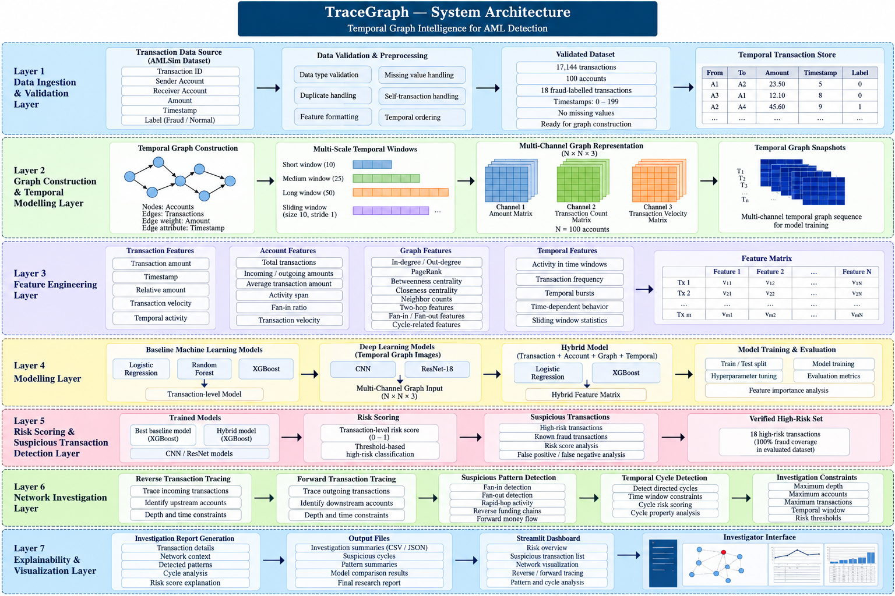

# TraceGraph — Temporal Graph Intelligence for AML Detection

TraceGraph is an AI-driven Anti-Money Laundering (AML) investigation system that models financial transactions as temporal graphs to identify suspicious transaction behavior and support network-level investigation.

Instead of analyzing transactions only as independent records, TraceGraph combines transaction attributes, account-level behavior, graph relationships, temporal activity, and multi-scale transaction patterns to identify potentially suspicious networks.

The system integrates machine learning, temporal graph analysis, bidirectional transaction tracing, suspicious-pattern detection, temporal cycle analysis, and an interactive Streamlit dashboard.

> TraceGraph is designed as an investigation-support system. A high-risk score indicates potentially suspicious activity for further investigation and does not by itself establish that a transaction is fraudulent.

---

## 1. Problem Statement

Traditional transaction-level fraud detection can miss patterns that emerge only when multiple accounts and transactions are considered together.

Money-laundering activity can involve behaviors such as:

- Multiple accounts sending funds into a common destination
- Funds moving rapidly through several accounts
- Repeated transfers between connected accounts
- Circular transaction flows
- Multi-account funding and redistribution
- Temporal patterns that are difficult to identify from isolated transactions

TraceGraph represents these relationships as a temporal transaction network and combines graph-level, account-level, transaction-level, and temporal features for AML risk analysis.

---

## 2. Key Idea

A financial transaction is represented as a directed edge:

```text
Sender Account ───────────────> Receiver Account
                  Amount
                Timestamp
```

The complete transaction dataset forms a directed temporal graph:

```text
                         ┌───────────┐
                         │ Account A │
                         └─────┬─────┘
                               │
                               ▼
                         ┌───────────┐
                         │ Account B │
                         └─────┬─────┘
                               │
                    ┌──────────┴──────────┐
                    ▼                     ▼
              ┌───────────┐         ┌───────────┐
              │ Account C │         │ Account D │
              └─────┬─────┘         └─────┬─────┘
                    │                     │
                    └──────────┬──────────┘
                               ▼
                         ┌───────────┐
                         │ Account E │
                         └───────────┘
```

TraceGraph analyzes both the individual transaction and the surrounding network context.

---

## 3. System Architecture

TraceGraph follows a layered architecture that combines temporal transaction modelling, graph-based feature engineering, machine learning, risk scoring, network investigation, and explainable visualization.

<p align="center">
  
</p>
```text
                    Transaction Sources
                           │
                           ▼
                  Data Validation
                           │
                           ▼
              Temporal Transaction Store
                           │
                           ▼
              Multi-Scale Graph Builder
                           │
             ┌─────────────┴─────────────┐
             ▼                           ▼
      Graph Features              Temporal Features
             │                           │
             └─────────────┬─────────────┘
                           ▼
                 Multi-Channel Graph
                    Representation
                           │
             ┌─────────────┴─────────────┐
             ▼                           ▼
       Baseline ML                 CNN / ResNet
             │                           │
             └─────────────┬─────────────┘
                           ▼
                    Risk Scoring
                           │
                           ▼
              Suspicious Transactions
                           │
             ┌─────────────┴─────────────┐
             ▼                           ▼
       Reverse Tracing             Forward Tracing
             │                           │
             └─────────────┬─────────────┘
                           ▼
             Suspicious Pattern Detection
                           │
                           ▼
              Temporal Cycle Detection
                           │
                           ▼
             Investigation Report
                           │
                           ▼
                 Streamlit Dashboard
```

---

## 4. Graph Representation

TraceGraph constructs a directed transaction graph where:

- Nodes represent accounts
- Directed edges represent transactions
- Edge weights represent transaction amounts
- Timestamps represent transaction timing
- Transaction counts capture repeated activity
- Temporal windows capture changing transaction behavior

The implementation preserves self-transactions and duplicate transactions where they occur in the source dataset.

---

## 5. Multi-Scale Temporal Modelling

Financial behavior can change over time, so TraceGraph analyzes transaction activity using multiple temporal windows.

The implementation uses:

```text
Short window  → 10 timestamp units
Medium window → 25 timestamp units
Long window   → 50 timestamp units
```

The dataset contains timestamps from `0` to `199` with 200 unique timestamp values.

Temporal analysis is used to capture:

- Transaction activity
- Transaction velocity
- Repeated transfers
- Localized bursts of activity
- Changes in account behavior
- Time-dependent graph relationships

The system also creates overlapping sliding temporal windows for deep-learning experiments.

---

## 6. Multi-Channel Graph Representation

TraceGraph converts transaction windows into multi-channel graph representations.

Each short temporal window is represented as:

```text
N × N × 3
```

where `N = 100` accounts.

The three graph channels are:

```text
Channel 1 → Transaction Amount
Channel 2 → Transaction Count
Channel 3 → Transaction Velocity
```

The resulting tensor representation is:

```text
20 non-overlapping windows
× 3 channels
× 100 accounts
× 100 accounts
```

For the sliding-window experiment, overlapping windows were generated with a window size of 10 and stride of 1.

---

## 7. Feature Engineering

TraceGraph combines transaction-level, account-level, graph-level, and temporal features.

### Transaction Features

Examples include:

- Transaction amount
- Timestamp
- Amount relative to sender behavior
- Transaction velocity
- Temporal activity

### Account Features

Examples include:

- Total transactions
- Incoming and outgoing transaction amounts
- Average transaction amounts
- Activity span
- Fan-in ratio
- Incoming/outgoing ratios
- Transaction velocity

### Graph Features

The graph feature engineering stage includes:

- In-degree
- Out-degree
- Weighted degree
- PageRank
- Betweenness centrality
- Closeness centrality
- Neighbor counts
- Two-hop neighborhood features
- Fan-in and fan-out relationships
- Cycle-related features
- Neighbor transaction amounts

These features provide network context that is not available from an isolated transaction record.

---

## 8. Machine Learning Pipeline

TraceGraph evaluates several modelling approaches.

### Baseline Models

- Logistic Regression
- Random Forest
- XGBoost

### Deep-Learning Models

- CNN
- ResNet-18

### Hybrid Models

The hybrid approach combines:

```text
Transaction Features
        +
Account Features
        +
Graph Features
        +
Temporal Features
        ↓
Hybrid Risk Model
```

The hybrid experiments were evaluated using Logistic Regression and XGBoost.

---

## 9. Experimental Dataset

The project uses the public AMLSim-based dataset used during development.

The validated dataset contains:

| Property | Value |
|---|---:|
| Transactions | 17,144 |
| Accounts | 100 |
| Alerts | 18 |
| Fraud-labelled transactions | 18 |
| Normal transactions | 17,126 |
| Fraud rate | 0.1050% |
| Unique timestamps | 200 |
| Timestamp range | 0–199 |
| Minimum transaction amount | 2.84 |
| Maximum transaction amount | 92.22 |
| Mean transaction amount | 34.1232 |
| Median transaction amount | 24.95 |

The dataset is highly imbalanced, with only 18 fraud-labelled transactions.

The raw dataset is **not included in this repository**.

See [`data/README.md`](data/README.md) for dataset information.

---

## 10. Model Evaluation

The baseline transaction-level experiments produced the following results on the evaluated test split.

| Model | Precision | Recall | F1 | ROC-AUC | PR-AUC |
|---|---:|---:|---:|---:|---:|
| Logistic Regression | 1.00 | 0.75 | 0.8571 | 0.9901 | 0.7558 |
| Random Forest | 1.00 | 0.25 | 0.4000 | 0.8701 | 0.7502 |
| XGBoost | 1.00 | 1.00 | 1.0000 | 1.0000 | 1.0000 |
| Hybrid Logistic Regression | 1.00 | 0.75 | 0.8571 | 0.9990 | 0.7976 |
| Hybrid XGBoost | 1.00 | 1.00 | 1.0000 | 1.0000 | 1.0000 |

### Important Evaluation Context

The test split contained only **4 positive fraud-labelled transactions**.

Therefore, these metrics should not be interpreted as evidence of production-level AML detection performance.

In addition, the hybrid feature experiment was computed using graph/account information derived from the complete dataset before the train/test split. This introduces potential temporal/data leakage.

Consequently, the hybrid model results are retained as exploratory research results rather than being presented as a production-valid benchmark.

---

## 11. Temporal Deep Learning Experiments

TraceGraph also evaluates CNN and ResNet-18 models using chronological sliding temporal windows.

The test results were:

| Model | Precision | Recall | F1 | ROC-AUC | PR-AUC |
|---|---:|---:|---:|---:|---:|
| TraceGraph CNN | 0.40 | 0.1111 | 0.1739 | 0.4487 | 0.5467 |
| TraceGraph ResNet-18 | 0.00 | 0.0000 | 0.0000 | 0.3120 | 0.4796 |

These results demonstrate that the temporal graph image representation and deep-learning models require further development and validation.

The experiments are included as part of the research pipeline rather than being presented as the final production model.

---

## 12. Risk Scoring

The investigation stage generates a transaction-level risk score.

The final evaluation produced:

```text
Total transactions        : 17,144
High-risk transactions    : 18
Known fraud transactions  : 18
High-risk fraud coverage  : 100%
```

More precisely:

> TraceGraph identified all 18 fraud-labelled transactions as high-risk in the evaluated AMLSim dataset.

This should not be interpreted as 100% fraud-detection accuracy because the result is based on the known injected fraud labels in this specific dataset and evaluation setup.

---

## 13. Temporal AML Investigation

After risk scoring, TraceGraph performs network-level investigation.

The investigation engine supports:

### Reverse Tracing

Starts from a suspicious transaction or destination account and follows incoming transactions backward.

```text
Source A ──► Account B ──► Account C
                         ▲
                    Investigation
                         │
                    starts here
```

This helps investigate potential upstream funding relationships.

### Forward Tracing

Starts from a suspicious transaction or account and follows outgoing transactions.

```text
Account A ──► Account B ──► Account C ──► Account D
     │
 Investigation
     starts here
```

This helps investigate potential downstream money flows.

### Investigation Constraints

Tracing is bounded using parameters such as:

- Maximum depth
- Maximum accounts
- Maximum transactions
- Temporal window
- Risk thresholds

This prevents unrestricted graph traversal from producing excessively large investigation networks.

---

## 14. Suspicious Network Patterns

TraceGraph detects several network-level patterns.

### Fan-In

Multiple accounts send funds into a common destination.

```text
A ──┐
B ──┤
C ──┼──► X
D ──┘
```

### Fan-Out

A source account distributes funds across multiple destinations.

```text
             ┌──► B
             │
A ───────────┼──► C
             │
             └──► D
```

### Rapid-Hop Activity

Funds move through connected accounts within a short temporal window.

```text
A → B → C → D
  t1  t2  t3
```

### Reverse Funding Chains

Tracing incoming transactions reveals potential upstream funding relationships.

### Forward Money Flow

Tracing outgoing transactions reveals downstream transaction paths.

### Temporal Cycles

Transactions form a directed cycle within a defined temporal span.

---

## 15. Suspicious Temporal Cycles

The final investigation detected two suspicious temporal cycles.

### Cycle 1

```text
20 → 39 → 81 → 82 → 43 → 20
```

Properties:

```text
Cycle length       : 5
Time span          : 13
Minimum risk score : 0.9986
Average risk score : 0.9993
```

All five transactions in this cycle had an amount of `19.60`.

### Cycle 2

```text
53 → 55 → 66 → 67 → 90 → 53
```

Properties:

```text
Cycle length       : 5
Time span          : 20
Minimum risk score : 0.9931
Average risk score : 0.9984
```

All five transactions in this cycle had an amount of `13.73`.

These cycles are identified as suspicious network structures for investigation; cycle detection alone does not establish criminal activity.

---

## 16. Investigation Summary

The final investigation stage produced:

| Investigation Output | Count |
|---|---:|
| Investigation records | 18 |
| Suspicious temporal cycles | 2 |
| Pattern types | 5 |
| Pattern instances | 38 |

The final pattern summary included:

- Suspicious reverse funding
- Suspicious temporal cycles
- Risk-aware fan-in
- Suspicious forward flow
- Risk-aware rapid-hop activity

---

## 17. Explainability

TraceGraph does not rely only on a transaction-level risk score.

The investigation layer provides contextual information such as:

- Sender and receiver
- Transaction amount
- Timestamp
- Risk score
- Reverse transaction relationships
- Forward transaction relationships
- Fan-in relationships
- Fan-out relationships
- Rapid-hop activity
- Suspicious cycles
- Account-network context

This allows an investigator to move from:

```text
Risk Score
    ↓
Suspicious Transaction
    ↓
Network Context
    ↓
Transaction Tracing
    ↓
Detected Pattern
    ↓
Investigation Report
```

---

## 18. Streamlit Dashboard

TraceGraph includes an interactive Streamlit dashboard for exploring the investigation results.

The dashboard is designed around the following workflow:

```text
Risk Overview
      ↓
Suspicious Transactions
      ↓
Network Investigation
      ↓
Reverse / Forward Tracing
      ↓
Pattern Detection
      ↓
Investigation Report
```

Dashboard source:

[`dashboard/app.py`](dashboard/app.py)

---

## 19. Project Structure

```text
TraceGraph_AML/
│
├── README.md
├── LICENSE
├── .gitignore
├── requirements.txt
│
├── data/
│   └── README.md
│
├── dashboard/
│   ├── app.py
│   └── requirements.txt
│
├── docs/
│   └── architecture.md
│
├── notebooks/
│   └── TraceGraph_AML.ipynb
│
├── models/
│   ├── tracegraph_cnn.pt
│   ├── tracegraph_resnet18.pt
│   ├── tracegraph_cnn_sliding.pt
│   ├── tracegraph_resnet18_sliding.pt
│   ├── tracegraph_channel_normalization.npz
│   ├── tracegraph_hybrid_logistic.pkl
│   └── tracegraph_hybrid_xgboost.pkl
│
├── results/
│   ├── tracegraph_final_metrics.csv
│   ├── TRACEGRAPH_FINAL_RESEARCH_REPORT.txt
│   ├── tracegraph_stage14_final_summary.json
│   ├── tracegraph_final_investigation_summary.csv
│   ├── tracegraph_final_investigations.json
│   ├── tracegraph_final_suspicious_cycles.csv
│   ├── tracegraph_final_pattern_summary.csv
│   ├── tracegraph_suspicious_transactions.csv
│   ├── tracegraph_model_comparison.csv
│   ├── hybrid_xgboost_feature_importance.csv
│   ├── hybrid_feature_group_importance.csv
│   ├── sliding_deep_learning_results.csv
│   └── deep_model_thresholds.csv
│
├── src/
│   └── README.md
│
└── screenshots/
    └── README.md
```

---

## 20. Installation

Clone the repository:

```bash
git clone https://github.com/Athishaya1127/TraceGraph_AML.git
cd TraceGraph_AML
```

Install dependencies:

```bash
pip install -r requirements.txt
```

The main research implementation is available in:

```text
notebooks/TraceGraph_AML.ipynb
```

The dashboard dependencies are available in:

```text
dashboard/requirements.txt
```

---

## 21. Running the Dashboard

Navigate to the dashboard directory:

```bash
cd dashboard
```

Install dashboard dependencies:

```bash
pip install -r requirements.txt
```

Run Streamlit:

```bash
streamlit run app.py
```

The dashboard expects the corresponding TraceGraph data/results structure used during development.

---

## 22. Reproducing the Research Pipeline

The complete implementation is provided in:

```text
notebooks/TraceGraph_AML.ipynb
```

The notebook covers the major development stages:

```text
Dataset Validation
        ↓
Graph Construction
        ↓
Temporal Modelling
        ↓
Multi-Channel Graph Representation
        ↓
Baseline Machine Learning
        ↓
CNN / ResNet Experiments
        ↓
Hybrid Graph + Transaction Features
        ↓
Risk Scoring
        ↓
Temporal Investigation
        ↓
Bidirectional Tracing
        ↓
Pattern Detection
        ↓
Temporal Cycle Detection
        ↓
Investigation Reports
        ↓
Streamlit Dashboard
        ↓
Final Evaluation
```

---

## 23. Limitations

TraceGraph is a research prototype and has several important limitations.

### Dataset Size

The evaluated dataset contains only 18 fraud-labelled transactions among 17,144 transactions.

This creates a severe class imbalance and makes model metrics sensitive to the small number of positive examples.

### Limited Temporal Range

The dataset contains timestamps from 0 to 199. These timestamp values should be interpreted according to the dataset's temporal representation rather than assumed to correspond directly to real-world hours or days.

### Hybrid Feature Leakage

The exploratory hybrid feature experiment computed graph/account features using the complete dataset before the train/test split.

This can introduce information leakage and inflate model performance.

The hybrid results are therefore not presented as a leakage-free production benchmark.

### Deep-Learning Performance

The sliding-window CNN and ResNet-18 experiments produced relatively weak test performance.

Further work is required in temporal modelling, graph neural networks, representation learning, class imbalance handling, and validation methodology.

### Synthetic / Simulated Behaviour

The dataset is an AML simulation dataset. Results obtained from simulated transaction networks cannot automatically be generalized to real financial institutions.

### Investigation Support

A high risk score or detected network pattern should be treated as an investigation signal rather than definitive proof of money laundering or fraud.

---

## 24. Future Work

Potential extensions include:

- Temporal Graph Neural Networks
- Graph Attention Networks
- GraphSAGE
- Dynamic graph embeddings
- Leakage-free temporal feature generation
- Time-based train/validation/test splits
- Larger and more diverse AML datasets
- Cost-sensitive learning
- Advanced class-imbalance techniques
- Explainable graph models
- Real-time transaction-stream processing
- Graph database integration
- Online risk scoring
- Investigator feedback loops
- Model monitoring and drift detection
- Production-scale distributed graph processing

---

## 25. Research Contribution

TraceGraph explores an investigation-oriented AML architecture that combines:

```text
Transaction-level analysis
          +
Account-level behavioural features
          +
Graph relationships
          +
Temporal modelling
          +
Multi-channel graph representation
          +
Machine learning
          +
Bidirectional tracing
          +
Network pattern detection
          +
Temporal cycle analysis
          +
Explainable investigation reports
```

The key emphasis is on moving beyond isolated transaction classification toward **network-aware temporal investigation**.

---

## 26. Technologies Used

### Programming

- Python

### Machine Learning

- Scikit-learn
- XGBoost
- PyTorch
- Torchvision

### Graph Analysis

- NetworkX

### Data Processing

- Pandas
- NumPy

### Deep Learning

- CNN
- ResNet-18

### Visualization / Application

- Streamlit

### Development Environment

- Google Colab
- Google Drive

---

## 27. Research Outputs

The repository contains the final outputs generated during the research pipeline, including:

- Model comparison results
- Final evaluation metrics
- Hybrid model feature importance
- Feature-group importance
- Suspicious transaction results
- Investigation summaries
- Suspicious temporal cycles
- Pattern summaries
- Deep-learning evaluation results
- Final research report

These outputs allow the experiments and investigation results to be reviewed without including the original large dataset.

---

## 28. Disclaimer

TraceGraph is an academic/research prototype for AML transaction-network analysis.

The system produces risk scores and suspicious-pattern indicators intended to support further investigation. It does not independently determine whether an individual or transaction is engaged in money laundering, fraud, or other criminal activity.

The reported experimental results are specific to the evaluated dataset and experimental configuration and should not be interpreted as production performance.

---

## 29. License

This project is released under the license included in [`LICENSE`](LICENSE).
